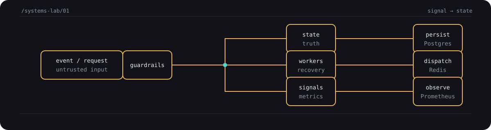

# Abhishek Kumar

### Backend, distributed systems, and AI-assisted developer tools

I build software around the parts that are easy to hand-wave: **coordination, consistency, isolation, recovery, and useful feedback**.

[Projects](#selected-work) · [Systems notes](#why-these-projects) · [Portfolio](https://github.com/abhishekkumarcoder21/abhishek_kumar_portfolio) · [GitHub](https://github.com/abhishekkumarcoder21)

---

## Selected work

These are the projects that best show how I think, not simply the projects with the most activity.

<table>
<tr>
<td width="50%" valign="top">

### [Distributed Workflow Engine](https://github.com/abhishekkumarcoder21/Distributed-Workflow-Engine)

A Go job processor and DAG orchestrator with at-least-once delivery, visibility-timeout recovery, weighted priority scheduling, idempotency, retries with jitter, and a Next.js control plane.

`Go` `PostgreSQL` `Redis` `Next.js` `Prometheus`

</td>
<td width="50%" valign="top">

### [SyncForge](https://github.com/abhishekkumarcoder21/Syncforge---Real-Time-Collaborative-Document-Platform)

A real-time collaborative editor built around a from-scratch RGA CRDT, WebSockets, offline operation replay, presence, snapshots, and an operation log.

`Go` `TypeScript` `React` `PostgreSQL` `Redis`

</td>
</tr>
<tr>
<td width="50%" valign="top">

### [CodeLens](https://github.com/abhishekkumarcoder21/CodeLens---AI-Code-Review-Platform)

A self-hosted GitHub PR review pipeline that combines deterministic AST checks, bounded repository context, specialized LLM reviewers, finding deduplication, and resilient review posting.

`Python` `FastAPI` `Next.js` `PostgreSQL` `Redis`

</td>
<td width="50%" valign="top">

### [Real-Time Multiplayer Server](https://github.com/abhishekkumarcoder21/Real-Time-Multiplayer-Game-Server)

A server-authoritative WebSocket game server exploring fixed-timestep simulation, client prediction, reconciliation, lag compensation, input validation, and telemetry.

`TypeScript` `Node.js` `WebSockets` `Docker` `Prometheus`

</td>
</tr>
</table>

## Why these projects

The recurring question across the work is: **what happens when messages arrive late, twice, out of order, or from an untrusted client?**

- **Workflow Engine** treats crashes and retries as normal operating conditions.
- **SyncForge** makes concurrent edits converge instead of relying on a happy-path central sequence.
- **CodeLens** puts deterministic checks before probabilistic reasoning and validates output before publishing it.
- **Multiplayer Server** separates client responsiveness from server authority under network latency.

<strong>Architecture patterns I keep returning to</strong>

- A durable source of truth paired with a fast, disposable coordination layer.
- Explicit state transitions instead of implicit side effects.
- Idempotency, bounded retries, and failure recovery at system boundaries.
- Instrumentation as part of the design, not a final dashboard layer.
- Small protocols that make trust and ownership visible.

## Current technical map

| Area | Evidence in the repositories |
|---|---|
| **Distributed systems** | Queues, DAG scheduling, visibility timeouts, CRDTs, WebSockets, fixed-timestep simulation |
| **Backend engineering** | Go, Python, TypeScript/Node.js, FastAPI, PostgreSQL, Redis |
| **AI-assisted tooling** | AST and regex analysis, context retrieval, token budgets, specialized review orchestration, evaluation workflows |
| **Web products** | Next.js, React, TypeScript, dashboards, collaborative interfaces |
| **Operations** | Docker Compose, GitHub Actions, Prometheus metrics, health checks, integration and load tests |
| **Foundations** | C/C++, Java, Python, data structures and algorithms repositories |

## A few deeper dives

<strong>Workflow Engine — recovery is a feature</strong>

Jobs move through explicit queue and persistence states. Redis handles ephemeral priority dispatch; PostgreSQL remains the source of truth. A visibility timeout lets the system requeue work after a worker disappears, while idempotency keys protect submission from duplicate execution. The repository also documents starvation mitigation, dead-letter handling, DAG cycle detection, and chaos tests.

→ [Read the architecture and trade-offs](https://github.com/abhishekkumarcoder21/Distributed-Workflow-Engine#-architecture)

<strong>SyncForge — convergence before convenience</strong>

The collaboration layer implements an RGA CRDT with Lamport timestamps, replica-aware operation IDs, tombstones, and deterministic ordering. Local edits render optimistically; operations are synchronized over WebSockets and persisted through snapshots plus an operation log. Presence and cross-instance coordination use Redis.

→ [Read how the CRDT works](https://github.com/abhishekkumarcoder21/Syncforge---Real-Time-Collaborative-Document-Platform#how-the-crdt-works)

<strong>CodeLens — probabilistic tools need deterministic edges</strong>

The review pipeline parses diffs, runs static rules, retrieves only relevant repository context under a token budget, invokes specialized reviewers, validates line boundaries, deduplicates nearby findings, and falls back from inline comments when GitHub rejects line placement. That shape keeps AI useful without making it the only source of truth.

→ [Read the review pipeline](https://github.com/abhishekkumarcoder21/CodeLens---AI-Code-Review-Platform#-system-architecture)

## Outside the flagship builds

A broader set of repositories shows the same range: [multi-tenant resource isolation](https://github.com/abhishekkumarcoder21/Multi-Tenant-SaaS-Backend-with-Resource-Isolation), [real-time order tracking](https://github.com/abhishekkumarcoder21/Real-Time-Order-Tracking-System), [AI-enhanced OTFS channel estimation](https://github.com/abhishekkumarcoder21/AI-enhanced-tracking-and-Channel-Estimation-for-OTFS-Modulation), [multimodal chatbot](https://github.com/abhishekkumarcoder21/multimodal-chatbot), and smaller interactive, educational, and frontend experiments.

## Contact

The most reliable way to reach me is through [GitHub](https://github.com/abhishekkumarcoder21). My [portfolio](https://github.com/abhishekkumarcoder21/abhishek_kumar_portfolio) collects the broader project set.

Built around a simple preference: make the hard parts explicit.

