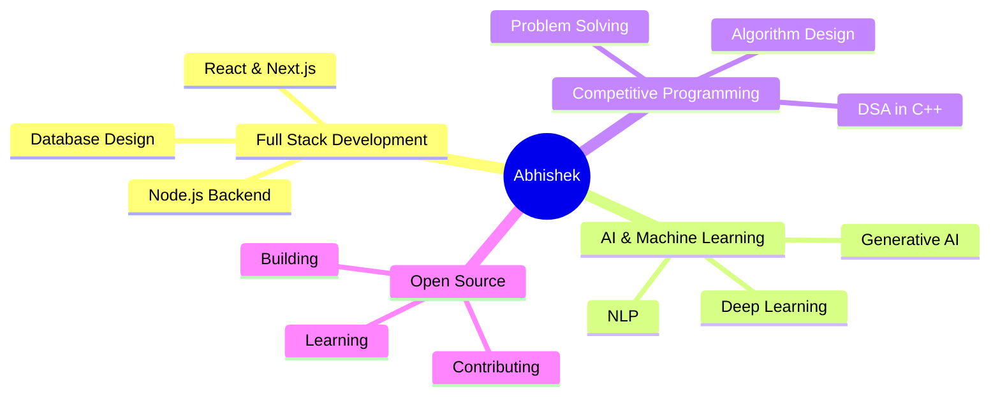

<div align="center">
  
</div>

<div align="center">
  
[](https://git.io/typing-svg)

</div>

<p align="center">
  
  
  
</p>

---

## 🧑‍💻 About Me

```javascript
const abhishek = {
    name: "Abhishek Kumar",
    location: "India 🇮🇳",
    education: "B.Tech @ IIIT Guwahati",
    role: "Full Stack Engineer",
    specialization: ["AI", "ML", "Deep Learning", "Generative AI"],
    currentFocus: "Building scalable applications with AI integration",
    lifePhilosophy: "Code is poetry written in logic",
    funFact: "I debug code faster than I debug my life 😄"
};
```

<div align="center">

### 🌟 "Striving to make the impossible, possible through code" 🌟

</div>

---

## 🚀 Tech Arsenal

<div align="center">

### 💻 Languages


### 🎨 Frontend


### ⚙️ Backend


### 🤖 AI/ML/DL


### 🛠️ Tools & Platforms


</div>

---

## 📊 GitHub Statistics

<div align="center">
  
  
</div>

<div align="center">
  
  
</div>

<div align="center">
  
</div>

---

## 💡 Coding Profiles

<div align="center">

| Platform | Profile | Stats |
|----------|---------|-------|
| 🟠 **LeetCode** | [Your Profile](#) |  |
| 🟢 **GeeksforGeeks** | [Your Profile](#) |  |
| 🟤 **CodeChef** | [Your Profile](#) |  |
| 🔵 **Codeforces** | [Your Profile](#) |  |

</div>

---

## 🌐 Connect With Me

<div align="center">

[](https://www.linkedin.com/in/11abhishek-kumar/)
[](https://x.com/abhishek_aiml27)
[](#)
[](mailto:abhishek.aiml06@gmail.com)

</div>

---

## 🎯 Current Focus

<div align="center">



</div>

---

## 📈 Contribution Snake

<div align="center">
  
</div>

---

## 💭 Quote of the Day

<div align="center">


</div>

---

## 🎮 When I'm Not Coding

<div align="center">

🎯 Exploring new AI models and frameworks  
📚 Reading tech blogs and research papers  
🏋️ Staying fit and healthy  
🎵 Listening to music while debugging  
🌍 Contributing to open source  

</div>

---

<div align="center">

### 💼 Open for Collaborations & Opportunities

**Let's build something amazing together!** 🚀


</div>

---

<div align="center">
  
**⭐ From [abhishekkumarcoder21](https://github.com/abhishekkumarcoder21) with ❤️**

</div>
